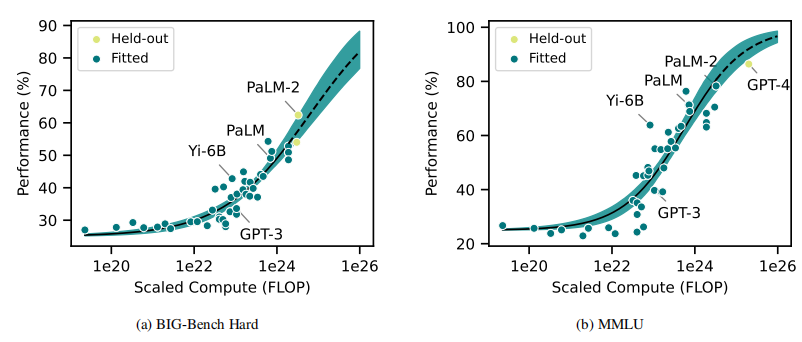

### How predictable is language model benchmark performance

大模型 Benchmark 表现的可预测性如何
$$
L(N,D) = \frac{A}{N^\alpha}+\frac{B}{D^\beta}+E
$$
L：预测的 Loss

N：模型 size

D：数据集 size

> To extrapolate, we fit curves relating **benchmark performance** to the **reducible loss**.

- **BIG-Bench**：一个异构的语言建模数据集，包含许多具有挑战性的任务。任务的性能以标准化首选指标（NPM）表示。
- **MMLU**：大规模多任务语言理解基准，包含GPT-4的性能结果。

验证：用 back-testing 回测，评估模型性能的可预测性。

### **Efficient Benchmarking (of Language Models)**

讨论如何设计**高效**的 Benchmark

computation-reliability trade-off

Decision Impact on Reliability(*DIoR*)

### 关注的问题

#### 大模型Benchmark怎么更好设计

#### 怎么预测大模型不同规模的性能

1. scaling laws 估算 loss
2. 拟合外推（loss <-> performance）