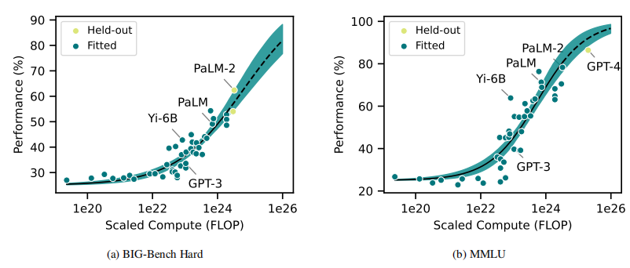

### 关注的问题

#### 怎么预测大模型不同规模的性能

1. scaling laws 估算 loss

2. 拟合外推（loss <-> performance）

   不同语言可能造成的影响，多语言 Benchmark

   数据污染，训练算法

#### 大模型Benchmark怎么更好设计

1. 选择 DIoR 高的 Decision

---

### How predictable is language model benchmark performance

大模型 Benchmark 表现的可预测性如何，预测方法？

1. scaling law 估算 loss

   Chinchilla scaling：

$$
L(N,D) = \frac{A}{N^\alpha}+\frac{B}{D^\beta}+E
$$
L：预测的 Loss

N：模型 size

D：数据集 size

其余常数由实验得到。

2. 拟合外推

> To extrapolate, we fit curves relating **benchmark performance** to the **reducible loss**.

一些可能用到的拟合函数形式：

用到的数据集，任务多样全面，比较有挑战性

- **BIG-Bench**：一个异构的语言建模数据集，包含许多具有挑战性的任务。任务的性能以标准化首选指标（NPM）表示。
- **MMLU**：大规模多任务语言理解基准，包含GPT-4的性能结果。

验证：用 back-testing 回测，评估模型性能的可预测性。

> Overall, our work suggests compute scaling provides a promising basis to forecast AI capabilities in diverse benchmarks, 
>
> though predicting performance in specific tasks poses challenges.

可预测性：计算规模可以预测总体性能，但不能很好地预测特定任务上的性能。

### **Efficient Benchmarking (of Language Models)**

讨论如何设计**高效**的 Benchmark

computation-**reliability** trade-off

> *Reliability* assesses the degree to which the evaluation answer remains **consistent** under different random decisions, 
>
> many of which are selections from the distribution of elements composing the benchmark.

Decision 比如数据集的选择，数据的划分，不同的 Scenarios...

Decision Impact on Reliability(*DIoR*)

